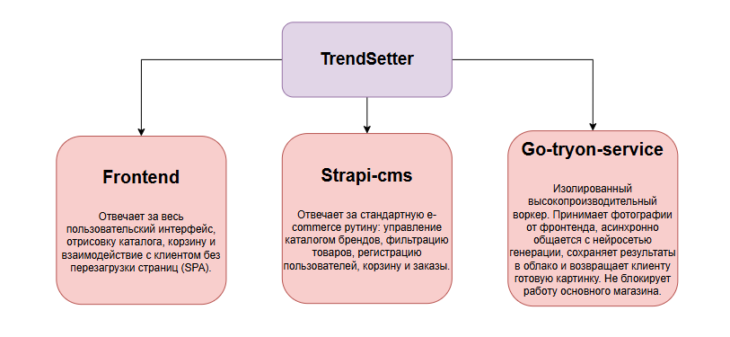

# TrendSetter

**TrendSetter** — это онлайн-платформа дизайнерской и крафтовой одежды с функцией интерактивной персонализации. Ключевая фича проекта — **виртуальная ИИ-примерка (AI Try-On)**, позволяющая покупателю загрузить свое фото и увидеть, как вещь будет сидеть на нем в реальности, до оформления заказа.

## Архитектура проекта

Проект реализован в формате монорепозитория (Monorepo) и состоит из трех независимых сервисов. Разделение бизнес-логики и тяжелых вычислительных задач обеспечивает высокую отказоустойчивость и скорость работы.

---

### 1. Frontend (Клиентская часть) - /frontend
Отвечает за весь пользовательский интерфейс, отрисовку каталога, корзину и взаимодействие с клиентом без перезагрузки страниц (SPA).
* **Стек:** React.js, Redux/Context (для стейт-менеджмента).
* **Расположение:** папка `/frontend`

### 2. Core Backend (Основной сервер / CMS) - /strapi-cms
Отвечает за стандартную e-commerce рутину: управление каталогом брендов, фильтрацию товаров, регистрацию пользователей, корзину и заказы. 
* **Стек:** Strapi (Node.js), PostgreSQL (База данных).
* **Расположение:** папка `/strapi-cms`

### 3. Try-On Microservice (Микросервис ИИ-примерки) - /go-tryon-service
Изолированный высокопроизводительный воркер. Принимает фотографии от фронтенда, асинхронно общается с нейросетью генерации, сохраняет результаты в облако и возвращает клиенту готовую картинку. Не блокирует работу основного магазина.
* **Стек:** Golang, фреймворк Gin.
* **Интеграции:** GenAPI.ru (генерация), Yandex Cloud Object Storage (S3 хранилище).
* **Расположение:** папка `/go-tryon-service`



---

## Запуск проекта в общей среде (Docker)
Этот режим предназначен для интеграционного тестирования, проверки взаимодействия всех микросервисов и финального деплоя на сервер. Docker Compose автоматически поднимет базу данных PostgreSQL, бэкенды (Strapi и Go) и соберет фронтенд.

### Предварительные требования
Убедитесь, что на вашем компьютере или сервере установлены **Docker** и **Docker Compose**.

### Шаги для запуска:

1. **Настройка переменных окружения:**
   * В корневой папке проекта создайте файл `.env` и укажите базовые настройки (доступы к БД, порты и JWT-секреты для Strapi) на примере а .env.exemple
   * В папке `go-tryon-service/` создайте свой файл `.env` с ключами для Yandex Cloud и GenAPI.

2. **Сборка и запуск контейнеров:**
   Откройте терминал в корневой папке проекта и выполните команду:
   ```bash
   docker-compose up -d --build
   ```  
3. **Доступ к сервисам:**
    после успешного запуска сервисы будут доступны по следующим адресам:
```
http://localhost:3000
```

сюда интерфейс обращается "под капотом" (например: «Strapi, отдай мне список товаров для каталога»).
```
http://localhost:4444
```
Админ strapi
```
http://localhost:4444/admin
```

сюда фронтенд будет напрямую отправлять картинки пользователей для виртуальной примерки (в твой микросервис на Go).
```
http://localhost:2222
```
Важное примечание для разработки: > Для написания кода или верстки интерфейса необязательно запускать весь тяжелый Docker-стек. Вы можете запустить нужный сервис локально. Например, если задача состоит только в изменении дизайна кнопок или верстке каталога, достаточно открыть терминал в папке frontend и запустить npm start (Hot Reload в Docker отключен для экономии ресурсов).